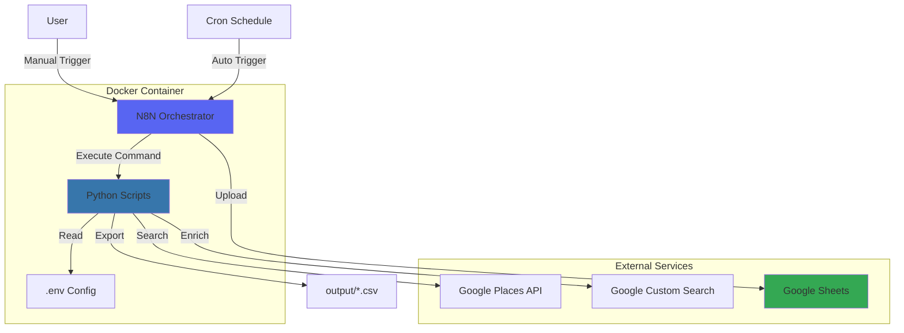
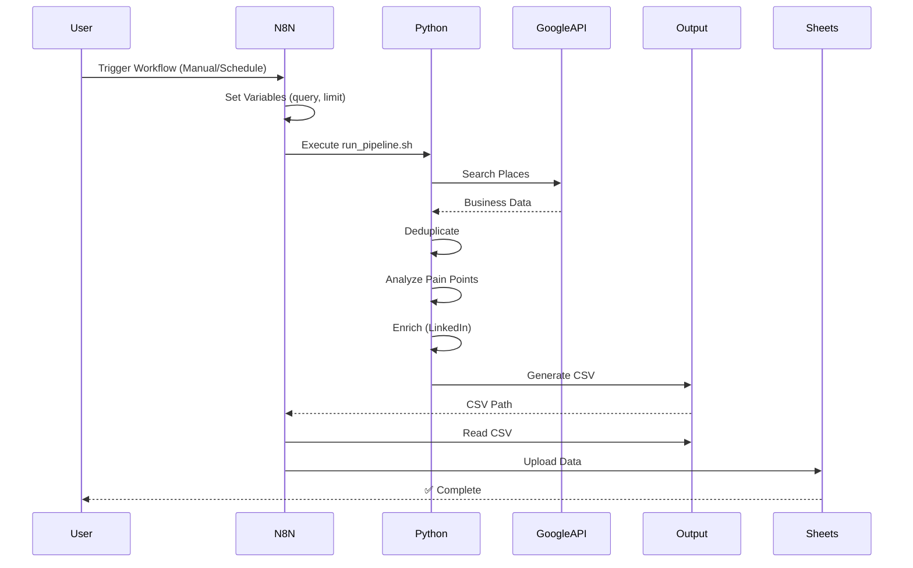
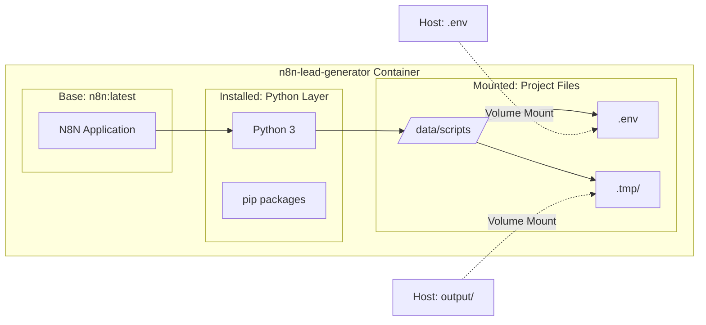
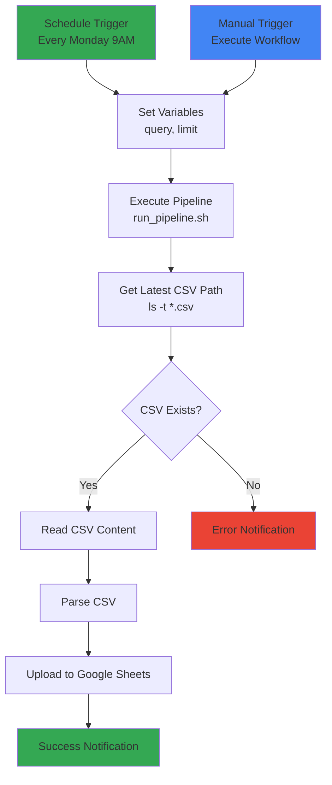
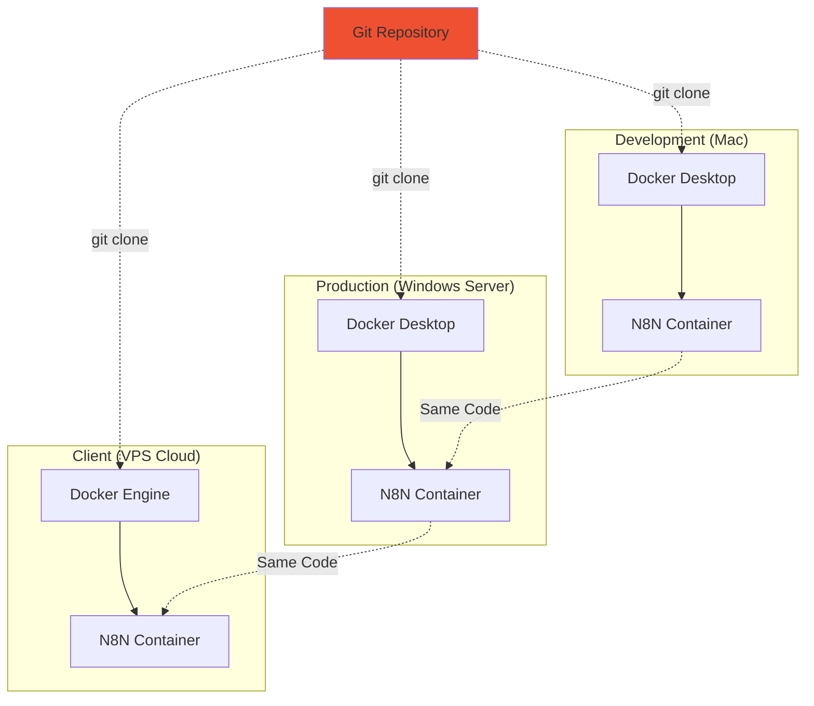
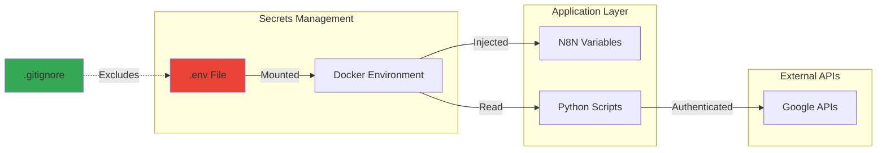
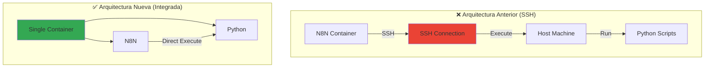

# Arquitectura del Sistema - Diagramas

## 🏗️ Arquitectura General

## 🔄 Flujo de Ejecución

## 📦 Estructura de Contenedor

## 🔀 Workflow N8N

## 🌐 Despliegue Multi-Plataforma

## 🔐 Flujo de Datos y Seguridad

## 📊 Comparación: Antes vs Ahora

---

## 📝 Notas

- **Mermaid**: Estos diagramas se renderizan automáticamente en GitHub
- **Editable**: Puedes modificar los diagramas editando el código Mermaid
- **Documentación Visual**: Útil para presentar a clientes o equipo

---

## 🔗 Referencias

- [Mermaid Documentation](https://mermaid.js.org/)
- [Docker Architecture](https://docs.docker.com/get-started/overview/)
- [N8N Documentation](https://docs.n8n.io/)
